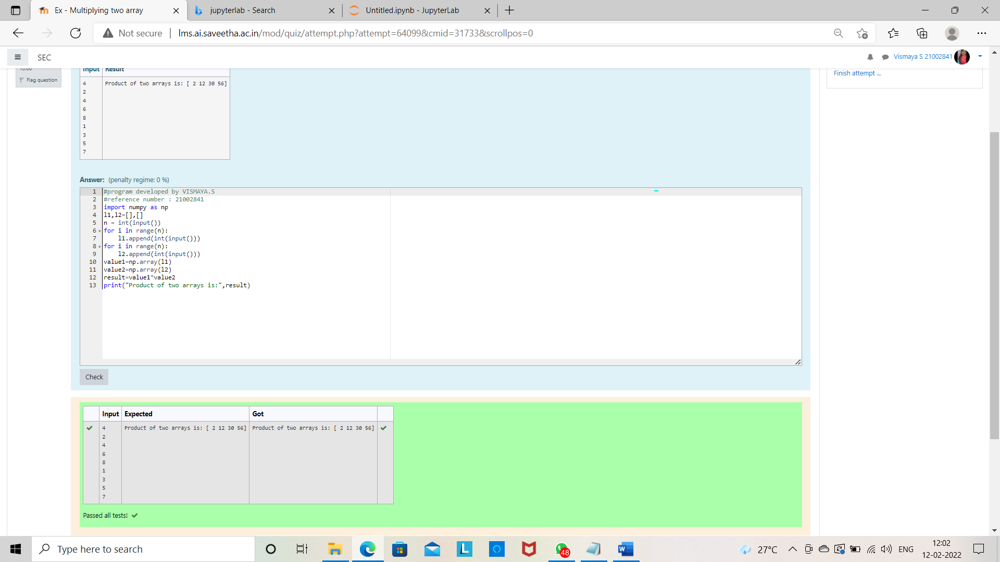

# Multiplying-two-matrix

## AIM:

## ALGORITHM:

### Step 1:
Use import numpy as np.

### Step 2:
Enter the input.

### Step 3:
Use append.

### Step 4:
Use * to multiply two matrix.

### Step 5:
Print

## PROGRAM: 
~~~
import numpy as np
l1,l2=[],[]
n = int(input())
for i in range(n):
    l1.append(int(input()))
for i in range(n):
    l2.append(int(input()))
value1=np.array(l1)
value2=np.array(l2)
result=value1*value2
print("Product of two arrays is:",result)
~~~
## OUTPUT:

## RESULT:
THUS THE MULTIPLICATION OF TWO MATRIX IS PERFORMED
